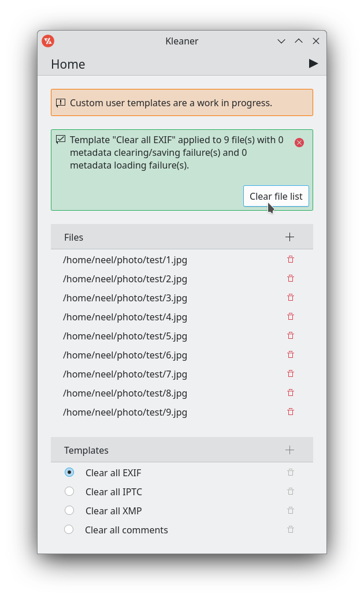

# Kleaner

Kleaner is an image metadata cleaner that can handle EXIF, IPTC, XMP and Comments. It is available under the GPL-3.0 license.

## Installation

Kleaner is available on Flathub.

## Screenshots

